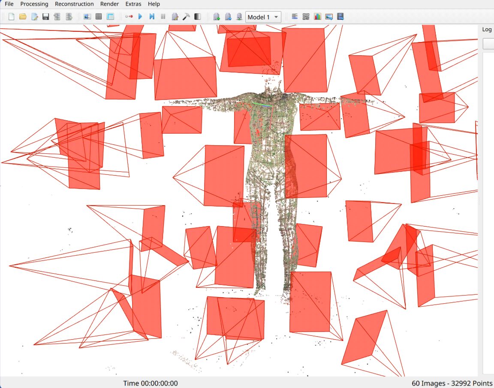
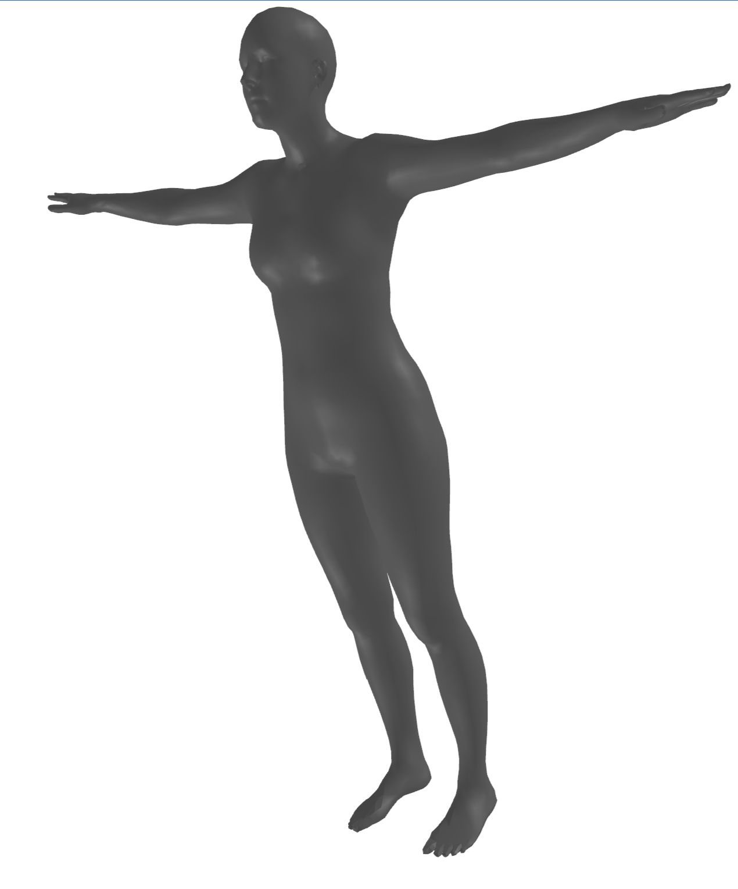

# ScanToSMPL

**Calibration-free SMPL registration from multi-view images and photogrammetry point clouds.**

Inspired by the potential of ML-driven insights to 3D rendering: [DesignRush Blog](https://news.designrush.com/3d-rendering-insights-rdc-design-group-interview)

Fits a parametric SMPL body mesh to ~60 uncalibrated scanner images — no camera extrinsics required. Camera geometry is self-recovered using the body mesh as a calibration target.


---

## Results

| Ground truth scan | Tier 1 — CameraHMR consensus mesh |
|:-----------------:|:---------------------------------:|
|  |  |
| *Photogrammetry point cloud* | *Consensus SMPL mesh, zero calibration* |

---

## Overview

Standard multi-view SMPL fitting tools (SMPLify-X, MultiviewSMPLifyX, EasyMocap) all require **pre-calibrated cameras in a shared coordinate frame**. Body scanners typically provide ~60 images with EXIF metadata but no extrinsic calibration.

ScanToSMPL solves this via a three-tier pipeline:

1. **Tier 1** — Per-view HMR with [CameraHMR](https://camerahmr.is.tue.mpg.de) fused into a consensus SMPL mesh. Zero calibration. ~2 min.
2. **Tier 2** — PnP self-calibration using the SMPL mesh + 138 dense surface keypoints to recover per-view `[R|t]`, then multi-view triangulation + reprojection refinement. ~3 min.
3. **Tier 3** — Surface refinement via differentiable chamfer distance (Kaolin) against the photogrammetry point cloud. ~5 min.

Each tier is independently shippable. Errors don't cascade — each tier improves the previous.

---

## Architecture

```
INPUT: ~60 images (EXIF-normalised) + optional point cloud (PLY/OBJ)
           │
           ▼
┌─────────────────────────────────┐
│  STAGE 0: DETECTION             │
│  RT-DETR → person bbox          │
│  ViTPose++ → 17 COCO keypoints  │
│  Classify: FULL / PARTIAL / SKIP│
│  Extract EXIF intrinsics        │
└────────────┬────────────────────┘
             │
             ▼
┌─────────────────────────────────┐
│  TIER 1: PER-VIEW HMR + FUSION  │
│  CameraHMR per full-body view:  │
│    β, θ + FoV + 138 dense kps   │
│  Consensus: β median,           │
│    θ SO(3) Fréchet mean         │
│  Output: ~40-50mm PA-MPJPE      │  ◄─── Tier 1 complete (shippable)
└────────────┬────────────────────┘
             │
             ▼
┌─────────────────────────────────┐
│  TIER 2: SELF-CALIBRATION       │
│  K from CameraHMR FoV / EXIF    │
│  solvePnPRansac (138 kps) →[R|t]│
│  Confidence-weighted DLT        │
│  SMPL optimisation: joint +     │
│    reprojection loss (all views) │
│  Output: target <25mm MPJPE     │  ◄─── Tier 2 complete (shippable)
└────────────┬────────────────────┘
             │
             ▼
┌─────────────────────────────────┐
│  TIER 3: SURFACE REFINEMENT     │
│  ICP: align point cloud → SMPL  │
│  Kaolin chamfer + semantic weights│
│  Optional SMPL+D displacements  │
│  Output: target <8mm chamfer    │  ◄─── Tier 3 complete (shippable)
└─────────────────────────────────┘
```

---

## Installation

### Prerequisites

- Python 3.10+
- PyTorch 2.0+ with CUDA 11.8+
- 8GB+ GPU (RTX 3080Ti 12GB recommended)

### Setup

```bash
git clone --recurse-submodules https://github.com/RalleyD/scan-to-smpl.git
cd scan-to-smpl
pip install -e ".[dev]"
```

For Tier 3 surface refinement (optional):

```bash
pip install -e ".[kaolin]"
```

### Model downloads

| Model | Source | Required for |
|-------|--------|-------------|
| SMPL `.pkl` files | [smpl-x.is.tue.mpg.de](https://smpl-x.is.tue.mpg.de) (free registration) | All tiers |
| CameraHMR checkpoint (`camerahmr_checkpoint_cleaned.ckpt`, 7.5GB) | [camerahmr.is.tue.mpg.de](https://camerahmr.is.tue.mpg.de) (free registration) | Tier 1 |
| FLNet checkpoint (`cam_model_cleaned.ckpt`) | Same as above | Tier 1 FoV |
| DenseKP checkpoint (`densekp.ckpt`) | Same as above | Tier 1 + Tier 2 PnP |
| ViTPose++ / RT-DETR | Auto-downloaded via HuggingFace on first run | All tiers |

Place SMPL files in `data/body_models/` and CameraHMR checkpoints in `models/`. See `models/README.md` for the expected directory layout.

---

## Quick start (TODO - See notes.md)

```bash
# Tier 1 only — zero calibration, images only
scantosmpl fit-images \
    --image-dir ./scan/images/ \
    --reference-pose t-pose \
    --output ./output/

# Tier 1+2+3 — full pipeline with point cloud
scantosmpl fit-combined \
    --image-dir ./scan/images/ \
    --pointcloud ./scan/mesh.ply \
    --reference-pose t-pose \
    --output ./output/

# Point cloud only
scantosmpl fit-pointcloud \
    --pointcloud ./scan/mesh.ply \
    --gender neutral \
    --output ./output/
```

Outputs written to `--output`:

| File | Contents |
|------|----------|
| `consensus_mesh.obj` | SMPL mesh (6890 verts, 13776 faces) |
| `consensus_results.json` | `betas` (10D), `body_pose` (69D), `global_orient`, per-view stats |
| `metrics.json` | PA-MPJPE per tier, chamfer distance |
| `debug/` | Per-view overlays, summary text |

---

## Development

```bash
# Unit tests (no GPU required)
pytest tests/ -v

# GPU integration tests
pytest tests/integration/ -v -m gpu

# Lint
ruff check scantosmpl/

# Type check
mypy scantosmpl/
```

---

## Package structure

```
scantosmpl/
├── config.py           # Dataclass configs for all pipeline stages
├── types.py            # ViewType, CameraParams, ViewResult, FittingResult
├── cli.py              # Click CLI entry points
│
├── detection/          # Phase 1: RT-DETR + ViTPose++ + view classification
├── hmr/                # Phase 2–3: CameraHMR inference, consensus fusion
├── calibration/        # Phase 4: PnP solver, intrinsics from FoV/EXIF
├── triangulation/      # Phase 5: DLT, RANSAC, weighted multi-view triangulation
├── smpl/               # SMPL wrapper, joint map, losses, pose prior
├── fitting/            # Coarse fit, reprojection, surface (Tier 2+3)
├── pointcloud/         # Phase 6: PLY/OBJ I/O, ICP alignment, segmentation
├── evaluation/         # MPJPE, PA-MPJPE, chamfer, reprojection metrics
└── utils/              # SO(3) geometry, visualisation helpers
```

---

## Technology choices

| Component | Choice | Reason |
|-----------|--------|--------|
| **Primary HMR** | CameraHMR | Full perspective camera model, FoV prediction (5–7° error), 138 dense surface keypoints for robust PnP |
| **Fallback HMR** | PromptHMR | 36.6mm PA-MPJPE on 3DPW; weights on Google Drive, no registration |
| **Person detection** | RT-DETR (HuggingFace) | Native `transformers` — no detectron2 |
| **2D keypoints** | ViTPose++-Base (HuggingFace) | 100M params, 4GB VRAM, stable in transformers ≥5.1.0 |
| **PnP** | OpenCV `solvePnPRansac` | 138 dense kps >> 12 sparse joints for RANSAC robustness |
| **Chamfer distance** | NVIDIA Kaolin | Apache 2.0, pip-installable, PyTorch 2.1–2.8, GPU-optimised |
| **Body model** | smplx ≥ 0.1.28 | Official PyTorch SMPL/SMPL-X implementation |

**Explicitly avoided**: HMR2.0 (unmaintained, detectron2 hell, GPU leak), PyTorch3D (no PyTorch 2.5+ support), MUC (PyTorch 1.12 + deprecated mmcv).

---

## Implementation status

| Phase | Description | Status |
|-------|-------------|--------|
| 0 | Scaffolding — SMPL model, config, CLI skeleton | ✅ |
| 1 | Detection — RT-DETR + ViTPose++ + view classification | ✅ |
| 2 | Per-view HMR — CameraHMR integration | ✅ |
| **3** | **Multi-view consensus — Tier 1 complete** | ✅ |
| 4 | PnP self-calibration | ✅ |
| **5** | **Triangulation + SMPL refinement — Tier 2** | 🔲 |
| 6 | Point cloud preprocessing + ICP alignment | 🔲 |
| **7** | **Surface refinement — Tier 3** | 🔲 |
| 8 | End-to-end pipeline + CLI | 🔲 |
| 9 | Packaging + CI | 🔲 |

See [REVIEW.md](REVIEW.md) for full acceptance criteria per phase.

---

## License

Apache 2.0 — see [LICENSE](LICENSE). Copyright 2026 Dan Ralley.

**Note on upstream model licenses**: The SMPL/SMPL-X body model files (`.pkl`) are subject to a non-commercial research license from Max-Planck-Innovation. CameraHMR weights are similarly research-only. This code is Apache 2.0, but using it end-to-end requires compliance with those upstream licenses. For commercial use of the body models, contact [Meshcapade](https://meshcapade.com).
